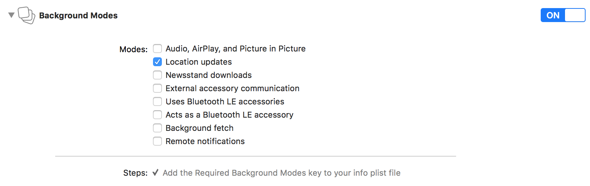

# AWAREFramework

[](https://travis-ci.com/tetujin/AWAREFramework-iOS)
[](http://cocoapods.org/pods/AWAREFramework)
[](http://cocoapods.org/pods/AWAREFramework)
[](http://cocoapods.org/pods/AWAREFramework)

[AWARE](http://www.awareframework.com/) is iOS and Android framework dedicated to instrument, infer, log and share mobile context information, for application developers, researchers and smartphone users. AWARE captures hardware-, software-, and human-based data (ESM). They transform data into information you can understand.

## Supported Sensors and Extensions

### Default Sensors
* Accelerometer
* Gyroscope
* Magnetometer
* Gravity
* Rotation
* Location
* Barometer
* Battery
* Network
* Call
* Processor
* Proximity
* Timezone
* Wifi
* Screen Events
* [Fitbit](https://dev.fitbit.com/)
* [Google Login](https://developers.google.com/identity/sign-in/ios/)
* Memory
* [NTPTime](https://github.com/jbenet/ios-ntp)
* [OpenWeatherMap](https://openweathermap.org/api)
* Headphone Motion (iOS 14 or later)

### Extensions
The following sensors can be used under extension(s)because these sensors need additional permission(s) into Info.plist and take a review by apple.
You can get detail information from [here](https://awareframework.com/minimize-sensor-import-on-ios/).
* Motion Activity
* Pedometer
* Bluetooth
* Heartrate (BLE)
* Microphone (Ambient Noise)
* Calendar
* Contact
* HealthKit

## Installation

### 1. Install AWAREFramework-iOS
AWAREFramework-iOS is available through [CocoaPods](http://cocoapods.org). 
To install it, simply add the following line to your Podfile:

```ruby
pod 'AWAREFramework', '~> 1.12'
```
And run `pod install` in your Xcode project.

### 2. Edit confgurations
For collecting data in the background, you need to edit `Info.plist` and `Capabilities/Background Modes` in the project as follows.

__[NOTE] The following settings are a minimum condition, so then you might need to do more modification if you are using special sensors (e.g., Ambient Noise, HealthKit, Activity Recognition and more). Please check this [link](https://awareframework.com/minimize-sensor-import-on-ios/) about the configuration.__

#### 2-1. Info.plist
* Privacy - Location Always and When In Use Usage Description
* Privacy - Location When In Use Usage Description
* Privacy - Location Always Usage Description

#### 2-2. Capabilities/Background Modes
* Location updates



### 3. Request permissions and activate AWAREFramework
To use AWAREFramework in the project, you need to (1) import `AWAREFramework` into your class and (2) request permission for accessing the iOS location sensor always. 
After the permission is approved, you can (3) activate `AWARECore`. 
(4) `AWARECore`,`AWAREStudy` and `AWARESensorManager` are singleton instances for managing sensing/synchronization schedules in the library.  You can control any sensors by the way which is described in How To Use session.

We recommend you to activate `AWARECore` at `-application:didFinishLaunchingWithOptions:launchOptions:` in `AppDelegate` which is called one time when the application is launched.

```swift
/// AppDelegate.swift ///
import UIKit
import AWAREFramework /// (1) import `AWAREFramework` into your source code.

@UIApplicationMain
class AppDelegate: UIResponder, UIApplicationDelegate{

    override func application(_ application: UIApplication, didFinishLaunchingWithOptions launchOptions: [UIApplicationLaunchOptionsKey: Any]?) -> Bool {
        
        ////////////////////////
        let core    = AWARECore.shared()
        let study   = AWAREStudy.shared()
        let manager = AWARESensorManager.shared()
        
        /// (2) request permissions
        core.requestPermissionForBackgroundSensing{ (status) in
            core.requestPermissionForPushNotification(completion:nil)
            
            /// (3) activate AWARECore
            core.activate()
            
            /// (4) use sensors 
            /// EDIT HERE ///
        
        }
        ////////////////////////
        
        return true
    }
}
```

## How To Use

### Example 1: Initialize sensors and save sensor data to the local database
Just the following code, your application can collect sensor data in the background. The data is saved in a local-storage.

```swift
/// Example1  (Swift): Accelerometer ///
let accelerometer = Accelerometer()
accelerometer.setSensorEventHandler { (sensor, data) in
    print(data)
}
accelerometer.startSensor()
manager.add(accelerometer)
```
### Example 2: Sync local-database and AWARE Server

AWAREFramework-iOS allows us to synchronize your application and AWARE server by adding a server URL to AWAREStudy. About AWARE server, please check our [website](http://www.awareframework.com/).

```swift
/// Example2 (Swift): Accelerometer + AWARE Server ///
study.setStudyURL("https://api.awareframework.com/index.php/webservice/index/STUDY_ID/PASS")
let accelerometer = Accelerometer(awareStudy: study)
accelerometer.startSensor()
accelerometer.startSyncDB()
// or
manager.add(accelerometer)
```

### Example 3: Apply settings on AWARE Dashboard

Moreover, this library allows us to apply the settings on AWARE Dashboard by using `-joinStuyWithURL:completion` method.

```swift
/// Example3 (Swift): AWARE Dashboard ////
let url = "https://api.awareframework.com/index.php/webservice/index/STUDY_ID/PASS"
study.join(withURL: url, completion: { (settings, studyState, error) in
    manager.addSensors(with: study)
    manager.startAllSensors()
})
```

## Experience Sampling Method (ESM)

This library supports ESM. The method allows us to make questions in your app at certain times. The following code shows to a radio type question at 9:00, 12:00, 18:00, and 21:00 every day as an example. Please access our website for learning more information about the ESM.

```swift
/// Swift ///
let schdule = ESMSchedule()
schdule.notificationTitle   = "notification title"
schdule.notificationBody    = "notification body"
schdule.scheduleId          = "schedule_id"
schdule.expirationThreshold = 60
schdule.startDate           = Date.init()
schdule.endDate             = Date.init(timeIntervalSinceNow: 60*60*24*10)
schdule.fireHours           = [9,12,18,21]

let radio = ESMItem(asRadioESMWithTrigger: "1_radio", radioItems: ["A","B","C","D","E"])
radio.setTitle("ESM title")
radio.setInstructions("some instructions")
schdule.addESM(radio)

let esmManager = ESMScheduleManager.shared()
// esmManager.removeAllNotifications()
// esmManager.removeAllESMHitoryFromDB()
// esmManager.removeAllSchedulesFromDB()
esmManager.add(schdule)
```

Please call the following chunk of code for appearing `ESMScrollViewController` (e.g., at `-viewDidAppear:`).

```swift
/// Swift ///
let schedules = ESMScheduleManager.shared().getValidSchedules() {
if(schedules.count > 0){
    let esmViewController = ESMScrollViewController()
    self.present(esmViewController, animated: true){}
}
```

### Supported ESM Types
This library supports 16 typs of ESMs.  You can see the screenshots from the [link](https://github.com/tetujin/AWAREFramework-iOS/tree/master/Screenshots/esms)

*  Text
*  Radio
*  Checkbox
*  Likert Scale
*  Quick Answer
*  Scale
*  DateTime
*  PAM
*  Numeric
*  Web
*  Date
*  Time
*  Clock
*  Picture
*  Audio
*  Video

## Example Apps
We are providing several example applications. You can refer, or modify these applications for your purpose.

* [RichClient (aware-client-ios-v2)](https://github.com/tetujin/aware-client-ios-v2)
* [SensingApp](https://github.com/tetujin/AWAREFramework-iOS/tree/master/Example/AWARE-SensingApp)
* [SimpleClient](https://github.com/tetujin/AWAREFramework-iOS/tree/master/Example/AWARE-SimpleClient)
* [DynamicESM](https://github.com/tetujin/AWAREFramework-iOS/tree/master/Example/AWARE-DynamicESM)
* [ScheduleESM](https://github.com/tetujin/AWAREFramework-iOS/tree/master/Example/AWARE-ScheduleESM)
* [CustomESM](https://github.com/tetujin/AWAREFramework-iOS/tree/master/Example/AWARE-CustomESM)
* [CustomSensor](https://github.com/tetujin/AWAREFramework-iOS/tree/master/Example/AWARE-CustomSensor)
* [Visualizer](https://github.com/tetujin/AWAREFramework-iOS/tree/master/Example/AWARE-Visualizer)

## Author

Yuuki Nishiyama <yuukin@iis.u-tokyo.ac.jp>

## Citation
Please cite the following paper(s) in your publications if this library helps your research. 

```
@InProceedings{aware_ios,
    author={Nishiyama, Yuuki and Ferreira, Denzil and Eigen, Yusaku and Sasaki, Wataru and Okoshi, Tadashi and Nakazawa, Jin and Dey, Anind K. and Sezaki, Kaoru},
    title={IOS Crowd--Sensing Won't Hurt a Bit!: AWARE Framework and Sustainable Study Guideline for iOS Platform},
    booktitle={Distributed, Ambient and Pervasive Interactions},
    year={2020},
    pages={223--243},
    isbn={978-3-030-50344-4},
    doi={10.1007/978-3-030-50344-4_17},
}

@inproceedings{aware_ios_in_the_wild,
    author = {Nishiyama, Yuuki and Ferreira, Denzil and Sasaki, Wataru and Okoshi, Tadashi and Nakazawa, Jin and Dey, Anind K. and Sezaki, Kaoru},
    title = {Using IOS for Inconspicuous Data Collection: A Real-World Assessment},
    year = {2020},
    doi = {10.1145/3410530.3414369},
    booktitle = {Adjunct Proceedings of the 2020 ACM International Joint Conference on Pervasive and Ubiquitous Computing and Proceedings of the 2020 ACM International Symposium on Wearable Computers},
    pages = {261–266},
    numpages = {6},
    series = {UbiComp-ISWC '20}
}
```


## License

AWAREFramework is available under the Apache2 license. See the LICENSE file for more info.
