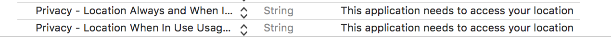

# AWAREFramework

[](https://travis-ci.org/tetujin/AWAREFramework)
[](http://cocoapods.org/pods/AWAREFramework)
[](http://cocoapods.org/pods/AWAREFramework)
[](http://cocoapods.org/pods/AWAREFramework)

[AWARE](http://www.awareframework.com/) is an OS and Android framework dedicated to instrument, infer, log and share mobile context information, for application developers, researchers and smartphone users. AWARE captures hardware-, software-, and human-based data (ESM). They transform data into information you can understand.

## Supported Sensors
* Accelerometer
* Gyroscope
* Magnetometer
* Gravity
* Rotation
* Motion Activity
* Pedometer
* Location
* Barometer
* Battery
* Network
* Call
* Bluetooth
* Processor
* Proximity
* Timezone
* Wifi
* Screen Events
* Microphone (Ambient Noise)
* Heartrate (BLE)
* Calendar
* Contact
* [Fitbit](https://dev.fitbit.com/)
* [Google Login](https://developers.google.com/identity/sign-in/ios/)
* Memory
* [NTPTime](https://github.com/jbenet/ios-ntp)
* [OpenWeatherMap](https://openweathermap.org/api)

## Example

To run the example project, clone the repo, and run `pod install` from the Example directory first.

### Exmaple 1: Initialize sensors and save sensor data to the local database
Just the following code, your application can collect sensor data in the background. The data is saved in a local-storage.
```objective-c
/// Example1 (Objective-C): Accelerometer ///
Accelerometer * accelerometer = [[Accelerometer alloc] init];
[accelerometer setSensorEventHandler:^(AWARESensor *sensor, NSDictionary *data) {
    NSLog(@"%@",data.debugDescription);
}];
[accelerometer startSensor];
```
```swift
/// Example1  (Swift): Accelerometer ///
let accelerometer = Accelerometer()
accelerometer.setSensorEventHandler { (sensor, data) in
    print(data)
}
accelerometer.startSensor()
```
### Exmaple 2: Sync local-database and AWARE Server

AWARECore, AWAREStudy, and AWARESensorManager are singleton instances for managing sensing/synchronization schedule in the library. You can access the instances via AWAREDelegate. The AWAREDelegate is described in the library installing section.  
```objective-c
AWAREDelegate * delegate = (AWAREDelegate *) [UIApplication sharedApplication].delegate;
AWARECore  * core  = delegate.sharedAWARECore;
AWAREStudy * study = core.sharedAwareStudy;
AWARESensorManager * manager = core.sharedSensorManager;
```

```swift
let delegate = UIApplication.shared.delegate as! AWAREDelegate
let core = delegate.sharedAWARECore
let study = core?.sharedAwareStudy
let manager = core?.sharedSensorManager
```

You can synchronize your application and AWARE server by adding a server URL to AWAREStudy. About AWARE server, please check our [website](http://www.awareframework.com/).

```objective-c
/// Example2 (Objective-C): Accelerometer + AWARE Server ///
[study setStudyURL:@"https://api.awareframework.com/index.php/webservice/index/STUDY_ID/PASS"];
Accelerometer * accelerometer = [[Accelerometer alloc] initWithStudy:study];
[accelerometer startSensor];

[accelerometer startSyncDB]; 
// or
[manager addSensor:accelerometer];
```
```swift
/// Example2 (Swift): Accelerometer + AWARE Server ///
study?.setStudyURL("https://api.awareframework.com/index.php/webservice/index/STUDY_ID/PASS")
let accelerometer = Accelerometer(awareStudy: study)
accelerometer.startSensor()
accelerometer.startSyncDB()
// or
manager?.add(accelerometer)
```

### Exmaple 3: Apply settings on AWARE Dashboard

You can appy the setting on AWARE Dashboard by using -joinStuyWithURL:completion method.

```objective-c
/// Example3 (Objective-C): AWARE Dashboard ////
NSString * url = @"https://api.awareframework.com/index.php/webservice/index/STUDY_ID/PASS";
[study joinStudyWithURL:url completion:^(NSArray *settings, AwareStudyState state, NSError * _Nullable error) {
    [manager addSensorsWithStudy:study];
    [manager startAllSensors];
}];

```
```swift
/// Example3 (Swift): AWARE Dashboard ////
let url = "https://api.awareframework.com/index.php/webservice/index/STUDY_ID/PASS"
study?.join(withURL: url, completion: { (settings, studyState, error) in
    manager?.addSensors(with: study)
    manager?.startAllSensors()
})
```

## Installation

AWAREFramework is available through [CocoaPods](http://cocoapods.org). To install it, simply add the following line to your Podfile:

```ruby
pod 'AWAREFramework', :git=>'https://github.com/tetujin/AWAREFramework-iOS.git'
```

Add permissions on Xcode for the background sensing (NOTE: the following permissions are minimum requirements)

* Info.plist
    * Privacy - Location Always and When In Use Usage Description
    * Privacy - Location Always Usage Description


* Capabilities/Background Modes
    * Location updates


For collecting your activities data in the background, your AppDelegate needs to succeed AWAREDelegate class.

Objective-C
```objective-c
/// AppDelegate.h ///
@import UIKit;
@import AWAREFramework;

@interface AWAREFrameworkAppDelegate: AWAREDelegate <UIApplicationDelegate>

@end
```
```objective-c
/// AppDelegate.m ///
#import "AppDelegate.h"

@implementation AppDelegate

- (BOOL)application:(UIApplication *)application didFinishLaunchingWithOptions:(NSDictionary *)launchOptions {
    [super application:application didFinishLaunchingWithOptions:launchOptions];
    return YES;
}

// ... Please call super classes (AWAREDelegate) methods when the application uses other methods on AppDelegate.

@end
```

Swift
```swift
import UIKit
import AWAREFramework

@UIApplicationMain
class AppDelegate: AWAREDelegate {

    override func application(_ application: UIApplication, didFinishLaunchingWithOptions launchOptions: [UIApplicationLaunchOptionsKey: Any]?) -> Bool {
        super.application(application, didFinishLaunchingWithOptions: launchOptions)
    return true
    }
    
    // ... Please call super classes (AWAREDelegate) methods when the application uses other methods on AppDelegate.
}
```

Your application needs to call permission request for the location sensor using following code when the application is opened first time. (e.g., -viewDidLoad on UIViewController)

Objective-C
```objective-c
AWAREDelegate * delegate = (AWAREDelegate *) [UIApplication sharedApplication].delegate;
AWARECore * core = delegate.sharedAWARECore;
[core requestBackgroundSensing]; // for background sensing
[core requestNotification:[UIApplication sharedApplication]]; // for notifications
```
    
Swift    
```swift
let delegate = UIApplication.shared.delegate as! AWAREDelegate
let core = delegate.sharedAWARECore
core.requestBackgroundSensing()
core.requestNotification(UIApplication.shared)
```

## Experience Sampling Method (ESM)

AWAREFramework-iOS supports ESM function. You can make ESMs by the following source code (e.g., send scheduled Radio ESM at 9:00, 12:00, 18:00, and 21:00).

```objective-c
/// Objective-C: Initialize an ESMSchedule ///
ESMSchedule * schedule = [[ESMSchedule alloc] init];
schedule.notificationTitle = @"notification title";
schedule.noitificationBody = @"notification body";
schedule.scheduleId = @"schedule_id";
schedule.expirationThreshold = @60;
schedule.startDate = [NSDate now];
schedule.endDate = [[NSDate alloc] initWithTimeIntervalSinceNow:60*60*24*10];
schedule.fireHours = @[@9,@12,@18,@21];

/// Make an ESMItem ///
ESMItem * radio = [[ESMItem alloc] initAsRadioESMWithTrigger:@"1_radio"
radioItems:@[@"A",@"B",@"C",@"D",@"E"]];
radio.esm_title = @"ESM title";
radio.esm_instructions = @"some instructions";

/// Add the ESMItem to ESMSchedule ///
[schedule addESMs:@[radio]];

/// Add the ESMSchedule to ESMScheduleManager ///
ESMScheduleManager * esmManager = [[ESMScheduleManager alloc] init];
[esmManager addSchedule:schedule];
```

```swift
\\\ Swift \\\
let schdule = ESMSchedule.init()
schdule.notificationTitle = "notification title"
schdule.noitificationBody = "notification body"
schdule.scheduleId = "schedule_id"
schdule.expirationThreshold = 60
schdule.startDate = Date.init()
schdule.endDate = Date.init(timeIntervalSinceNow: 60*60*24*10)
schdule.fireHours = [9,12,18,21]

let radio = ESMItem.init(asRadioESMWithTrigger: "1_radio", radioItems: ["A","B","C","D","E"])
radio?.esm_title = "ESM title"
radio?.esm_instructions = "some instructions"
schdule.addESM(radio)

let esmManager = ESMScheduleManager.init()
// esmManager.removeAllNotifications()
// esmManager.removeAllESMHitoryFromDB()
// esmManager.removeAllSchedulesFromDB()
esmManager.add(schdule)
```

Please call the following chunk of code for appearing ESMScrollViewController (e.g., at -viewDidAppear: ).

```objective-c
\\\ Objective-C: check valid ESMs and show ESMScrollViewController \\\
ESMScheduleManager * esmManager = [[ESMScheduleManager alloc] init];
NSArray * schdules = [esmManager getValidSchedules];
if (schdules.count > 0) {
    /** initialize ESMScrollView */
    ESMScrollViewController * esmView  = [[ESMScrollViewController alloc] init];
    /** move to ESMScrollView */
    [self presentViewController:esmView animated:YES completion:nil];
    /** or, following code if your project using Navigation Controller */
    // [self.navigationController pushViewController:esmView animated:YES];
}
```
```swift
\\\ Swift \\\
let esmManager = ESMScheduleManager.init()
let schedules = esmManager.getValidSchedules()
if let unwrappedSchedules = schedules {
    if(unwrappedSchedules.count > 0){
        let esmViewController = ESMScrollViewController.init()
        self.present(esmViewController, animated: true) {
        }
    }
}
```

### Supported ESM Types
AWAREFramework-iOS supports 16 typs of ESMs (Text, Radio, Checkbox, Likert Scale, Quick Answer, Scale, DateTime, PAM, Numeric, Web, Date, Time, Clock, Picture, Audio, and Video)

#### Text
#### Radio
#### Checkbox
#### Likert Scale
#### Quick Answer
#### Scale
#### DateTime
#### PAM
#### Numeric
#### Web
#### Date
#### Time
#### Clock
#### Picture
#### Audio
#### Video

## Author

tetujin, tetujin@ht.sfc.keio.ac.jp

## License

AWAREFramework is available under the Apache2 license. See the LICENSE file for more info.
